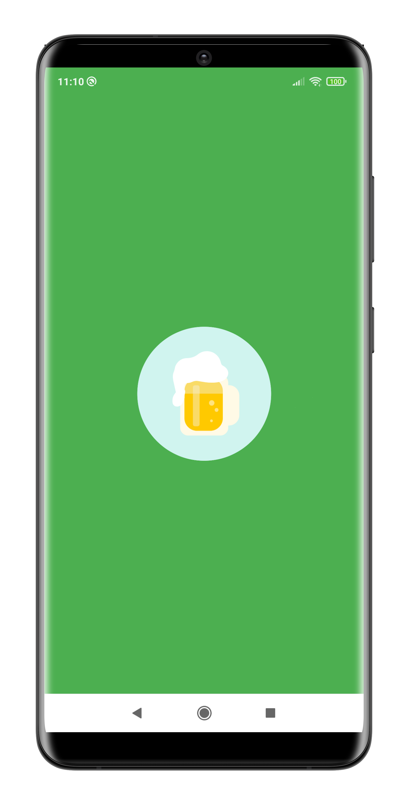
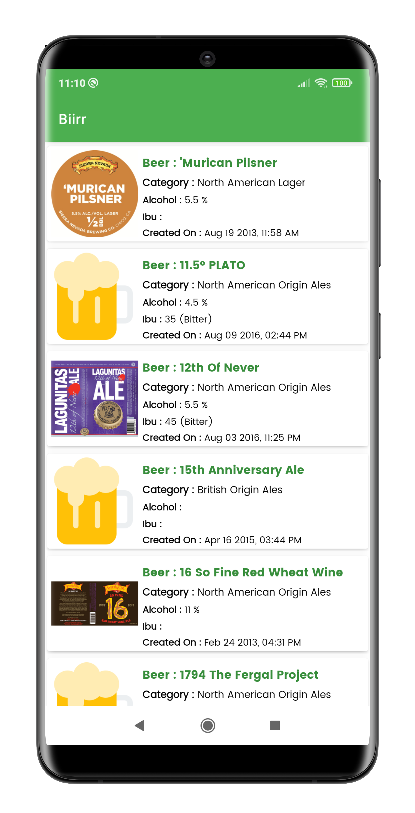
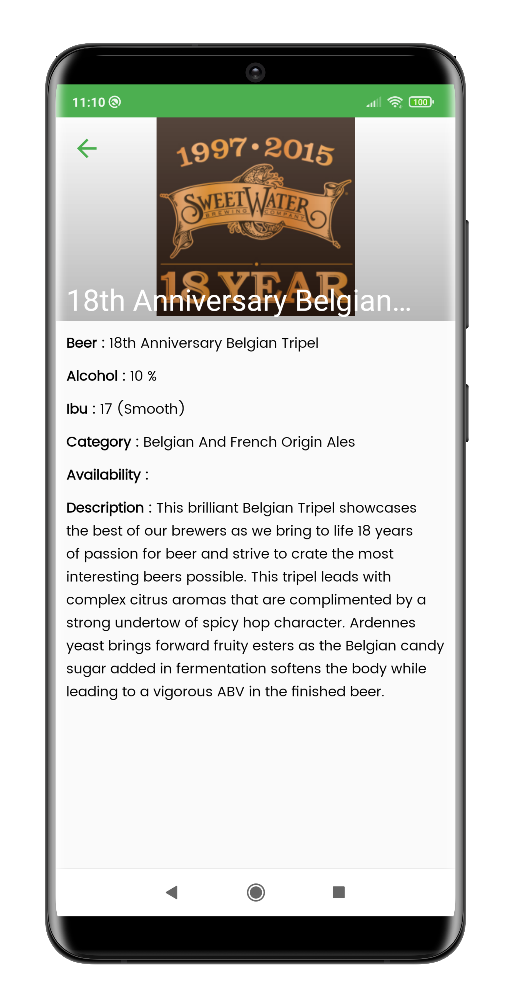
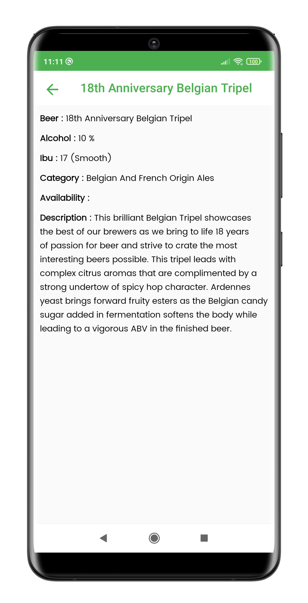
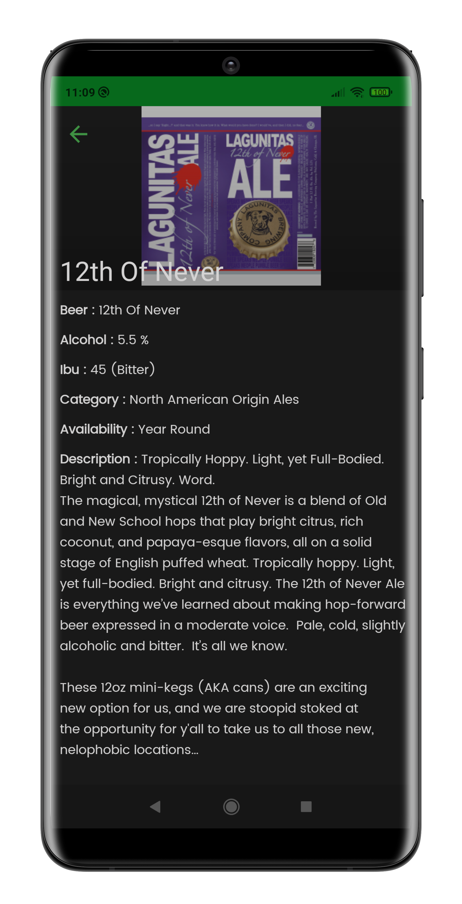

# BiirrDemo

 - [Video on YouTube](https://youtu.be/RaFFAeY-SwI) 
 - [Download Apk](https://raw.githubusercontent.com/ddpatel2606/Biirr/master/apk/app-release.apk)
 

Beer Api Listing
 
 - [Beer listing API](http://api.brewerydb.com/v2/beers/?key=13d7fdca22cbc95434f3f65d7be4a5a9&p=1)
 
 ## Activities
 - MainActivity - Listing Beers
 - DetailActivity - Details of selected Beer
 
 ## Tech stack & Open-source libraries
 - Minimum SDK level 24
 - [Kotlin](https://kotlinlang.org/) based, 
 - [Coroutines](https://github.com/Kotlin/kotlinx.coroutines) for asynchronous.
 - [Dagger dependency injection](https://developer.android.com/training/dependency-injection/dagger-basics)
 
 - JetPack
   - LiveData - notify domain layer data to views.
   - Lifecycle - dispose of observing data when lifecycle state changes.
   - ViewModel - UI related data holder, lifecycle aware.
   
 - Architecture
   - MVVM Architecture (Model View ViewModel - DataBinding)
   - Repository Design Pattern(Provides abstraction layer)
  
 - [Retrofit2 & OkHttp3](https://github.com/square/retrofit) - construct the REST APIs and paging network data.
 - [HttpInterceptor](https://github.com/square/okhttp/tree/master/okhttp-logging-interceptor) - An OkHttp interceptor which logs HTTP request and response data.
 - [Gson](https://github.com/google/gson) - A modern JSON library for Kotlin and Java.
 - [Picasso](https://github.com/square/picasso) - loading images.
 - [Lottie](https://github.com/airbnb/lottie-android) - Splash screen animation.
 - [ShimmerView](https://github.com/facebook/shimmer-android) - Shimmer Loading View.
 - [SwipeToRefreshLayout](https://developer.android.com/jetpack/androidx/releases/swiperefreshlayout) - implement swipe to refresh layout.
 - [Timber](https://github.com/JakeWharton/timber) - logging.
 - [Material-Components](https://github.com/material-components/material-components-android) - Material design components like ripple animation, cardView.
 - Custom Views
 - [CircularProgressView](https://github.com/rahatarmanahmed/CircularProgressView) - A polished and flexible CircleProgressView, fully customizable with animations.

## Images

```SplashActivity```





```MainActivity : Light Mode```





```DetailActivity : Light Mode```







```MainActivity : Dark Mode```


```DetailActivity : Dark Mode```



